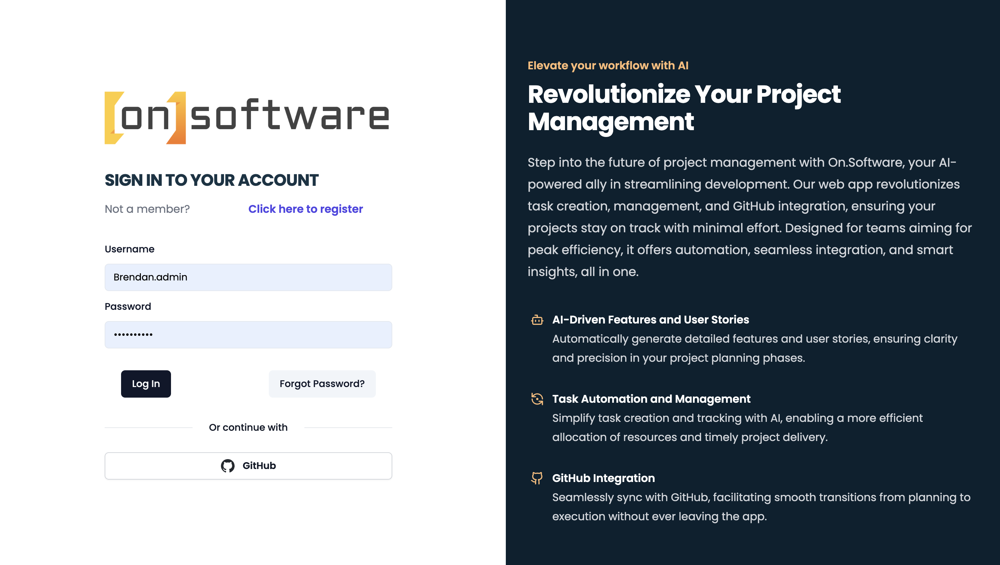

# Building an AI company from scratch

## Overview and Origin

### [ON.SOFTWARE](https://www.On.software)

### When was the company incorporated?

On.software was founded in 2024 as a spinout of Via Capita, Inc. a Delaware C-corp

### Who are the founders of the company?

Brendan OHara

### How did the idea for the company (or project) come about?

While working on a product for an online claims management platform, I ran into a big roadblock: unclear requirements, too few user stories, vague acceptance criteria, and poorly defined tasks. I started thinking, what if an AI system could make this process way better and faster than the usual slow and inefficient methods used by companies like my client?

### How is the company funded? How much funding have they received?

The company is currently self-funded and looking to roll out a beta version in July. Then we will seek funding once a requisite number of users have used the software and given feedback.

## Business Activities

### What specific problem is the company or project trying to solve?

On.software tackles the usual headaches in project management like unclear requirements, too few user stories, vague acceptance criteria, and poorly defined tasks. We noticed these issues were really dragging down the development process, so we brought in smart AI to help create detailed features and user stories. We’ve also built in a feedback loop so users can tweak or clarify AI suggestions. This way, everyone is on the same page during project planning, making it easier for teams to understand and hit their project goals.

Additionally, On.software looks to innovate and enhance task creation and management through AI-driven automation, estimating and suggesting resource allocation and hopefully ensuring timely project delivery or at the very least ensure that any delays are clear far in advance. The platform helps teams smoothly move from planning to getting the job done. By addressing these inefficiencies, On.software helps development teams achieve peak efficiency and productivity.

### Who is the company's intended customer?

On.software is for development teams and project managers who want to boost productivity and create innovative, cool products. Many companies struggle with unclear project requirements, sparse user stories, vague acceptance criteria, and tasks that don’t align with the bigger goals. On.software tackles these issues using AI to automate and streamline the whole product and project management process. This will reduce misunderstandings and miscommunications, leading to more accurate and efficient development cycles. The platform’s AI-driven task generation and enhancement capabilities will enable teams to allocate resources more effectively and deliver projects that actually meet defined business goals as opposed those that need continual changes as they don't actually deliver value.

Looking ahead, On.software will also cater to entrepreneurs, providing them with a valuable tool for brainstorming and refining their ideas. By integrating AI development tools, it will facilitate the creation of new products and services, acting as a sounding board and an intelligent assistant. This could more broadly empower entrepreneurs to innovate more efficiently, or perhaps even abandon projects as they see they cannot deliver value in the way they had envisioned.

### Is there any information about the market size of this set of customers?

> Jira is a market leader and potential partner and target to acquire On.software. Atlassian, the company that makes Jira, has 882 enterprise customers that spend $500,000+ annually, up 44% from the year-ago level. At the upper end, there are 353 accounts with $1 million or more of annual spend, up 52%. ([Forbes Aug 23, 2023](https://www.forbes.com/sites/robertdefrancesco/2023/08/23/atlassian-is-gaining-ground-in-the-enterprise-market/?sh=4db233dc22c5))

Atlassian annual revenue for 2023 was $3.535B, a 26.11% increase from 2022. Atlassian annual revenue for 2022 was $2.803B, a 34.16% increase from 2021. ([Macrotrends](https://www.macrotrends.net/stocks/charts/TEAM/atlassian/revenue))

### What solution does this company offer that their competitors do not or cannot offer? (What is the unfair advantage they utilize?)

On.software is unique because it democratizes and enhances project/product management through AI. With a powerful mix of automation, integration, and AI tools, it boosts productivity and efficiency while fostering innovation, setting it apart from the competition.

The core technology behind On.software is a combination of standard software and advanced artificial intelligence. This is employed to allow textual input to be used, as well as a huge datastore of information about software planning and practices, to help with the creation of project requirements, user stories, and tasks.

### Which technologies are they currently using, and how are they implementing them?

On.software’s tech stack uses a mix of tools and frameworks to keep development smooth and efficient. At its core, we use Svelte, a popular framework that helps us build fast web apps with clean and simple code.

On the backend, Prisma is the ORM tool we use, enabling simple database interactions and schema management. The integration with GitHub is managed through custom Github Apps and an Node.js API, ensuring smooth communication between the platforms. Additionally, Express.js is used as the server framework, providing a flexible backend for the API and automated services and cron jobs.

The most significant part of On.software's stack is its integration with the OpenAI API. This integration allows us to harness the power of  artificial intelligence to generate detailed project requirements, user stories, and tasks. On.software can provide intelligent insights and automate many aspects of product planning and project management. File caching mechanisms are employed to store and quickly retrieve frequently used data, enhancing performance and reducing latency in AI responses. This makes sure the AI is quick to respond and gives detailed answers, providing users genuine new, cool and innovative responses while building their project and product requirements.

For styling, the stack includes Tailwind CSS, along with its plugins for forms, typography, aspect ratio, and container queries, As common with applications like this Prettier and ESLint are integrated for code formatting and linting, ensuring that the codebase remains relatively clean and maintainable.

Testing is handled by Playwright and Vitest. TypeScript is utilized for type checking, ensuring type safety across the codebase. We also incorporate a variety of libraries such as Chart.js, Quill and many others.

## Landscape

### What field is the company in?

Software Development Tools, specifically AI driven development, project management and product management.

### What have been the major trends and innovations of this field over the last 5&ndash;10 years?

Over the past 2-3 years, significant trends and innovations have emerged in the field of software development tools, particularly those driven by artificial intelligence (AI) in development, project management, and product management.

One of the most interesting trends has been the integration of generative AI into various business functions. Companies that excel in AI are using generative AI to optimize their workflow and risk management and perhaps to reduce mistakes in in human resources functions.​ ([McKinsey & Company](https://www.mckinsey.com/capabilities/quantumblack/our-insights/the-state-of-ai-in-2023-generative-AIs-breakout-year)).

In project management, AI-driven automation has become a cornerstone. AI technologies are increasingly used to automate repetitive tasks. This allows project managers to focus on strategy as opposed to operations, the drive to enhance project efficiency and success rates. ​ ([LeewayHertz - AI Development Company](https://www.leewayhertz.com/ai-in-project-management))​​ ([Encora](https://www.encora.com/insights/ai-driven-development))​.

Another significant trend is the emphasis on integration and collaboration tools. The rise of remote and hybrid work environments has driven the need for project management software that works fairly smoothly with other tools, such as time tracking and resource management.​ ([The Digital Project Manager](https://thedigitalprojectmanager.com/industry/reports/project-management-trends/))​.

In the world of product management, AI is becoming a real game-changer for decision-making. New tools can sift through mountains of data to spot patterns, trends, and connections that might slip past with the old-school processes. GitHub Copilot and ChatGPT, for example are enhancing developer workflows by offering real-time code suggestions and automating code generation.​ ([Encora](https://www.encora.com/insights/ai-driven-development)).

Overall, these trends show a growing impetus on AI to drive efficiency, innovation, and collaboration in software development, product management and project management, changing these fields significantly.

### What are the other major companies in this field?

Several companies are at the forefront of marketing the utilization of AI in project management, development, and product management. They claim to be driving innovation and efficiency in these fields but I am somewhat skeptical based on the fact that some of these projects seem to be standard software with very little actual AI.

Microsoft integrates AI to automate repetitive tasks and improve project outcomes. They are also a major investor in OpenAI​ ([LeewayHertz - AI Development Company](https://www.leewayhertz.com/ai-in-project-management))​.

Google uses AI across its internal operations as well as integrating with Google Suite offerings​ ([LeewayHertz - AI Development Company](https://www.leewayhertz.com/ai-in-project-management))​.

Salesforce uses AI to streamline project management tasks. AI intended to helps identify potential customers, recommend efficient strategies, and resolve issues quickly​ ([LeewayHertz - AI Development Company](https://www.leewayhertz.com/ai-in-project-management))​.

IBM leverages AI to optimize processes and manage risk in. Their tools automatically generate risk assessments and offer mitigation strategies​ ([LeewayHertz - AI Development Company](https://www.leewayhertz.com/ai-in-project-management))​.

Other notable companies include [Asana](https://asana.com/), [Wrike](https://www.wrike.com/), and [ClickUp](https://clickup.com/). These all offer some features that cross over with On.software and we will look to differentiate our product wherever possible​ ([Agility Portal](https://agilityportal.io/blog/top-6-ai-powered-project-management-tools-to-use-in-2023)).

[Builder.ai](https://www.builder.ai/) is a no-code app development platform powered by AI, enabling the creation of software without coding experience.

## Results

### What has been the business impact of this company so far?

At this stage, my team and I are using our software internally, embracing the principle of "eating our own dog food." However, since we have not yet released even an Alpha version, we do not have any results to report.

### What are some of the core metrics that companies in this field use to measure success? How is your company performing based on these metrics?

External metrics are typically user adoption rates, project completion times, customer satisfaction, and the actual number and hours of use and it what sections of our app. We do not have measurable data for these metrics. We are focusing on internal testing to ensure our product is effective and trying to innovate at the same time. Obviously, we will need to build our own internal metrics as it relates to the speed at which people complete our AI assisted tasks and whether they heavily edit the responses so we determine what metrics matter to us internally.

### How is your company performing relative to competitors in the same field?

Not really applicable

## Recommendations

### If you were to advise the company, what products or services would you suggest they offer? (This could be something that a competitor offers, or use your imagination!)

Well I am building the software and it is the reason I am in this AI Bootcamp. Using the KANO term "delighters", I want to offer users of On.Software many integrated tools that facilitate innovation in their own teams. That is a tall order, clearly, but that is the intent.

